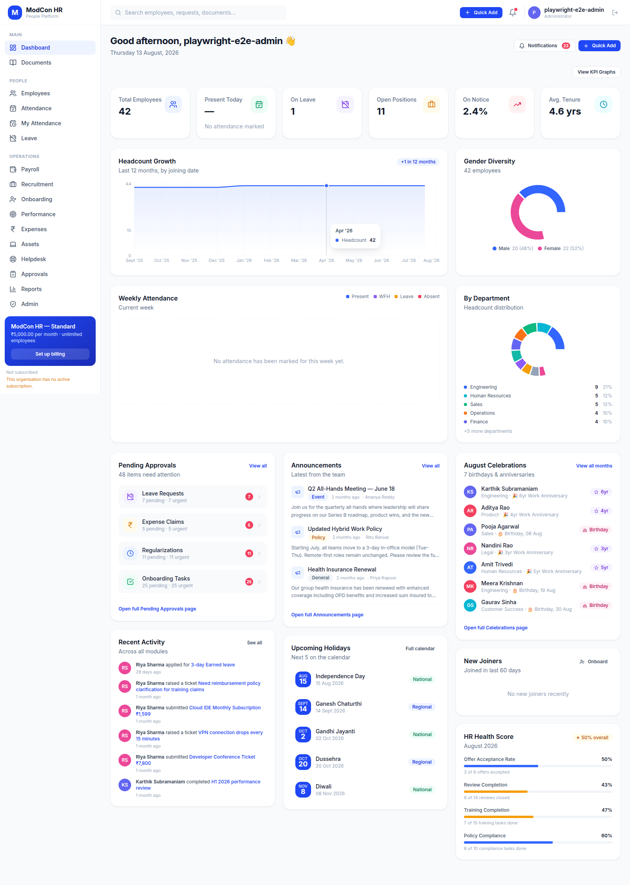
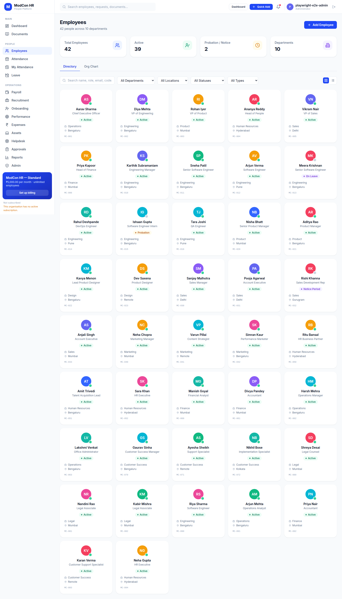
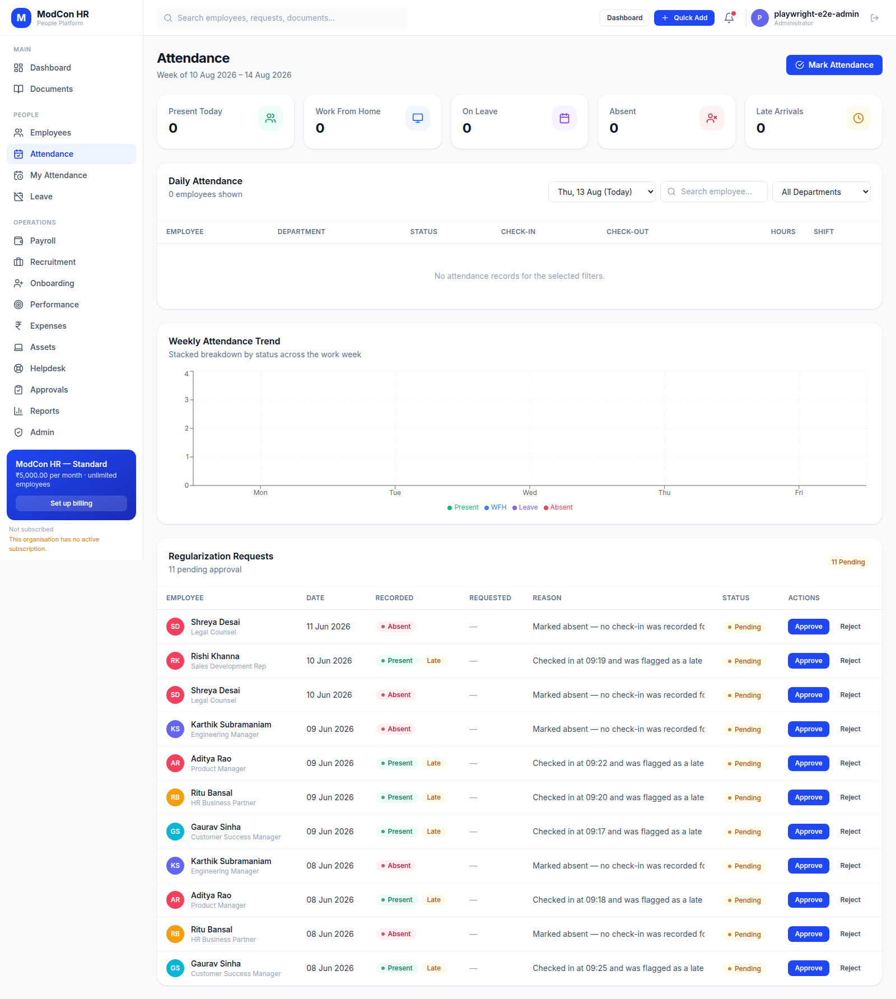
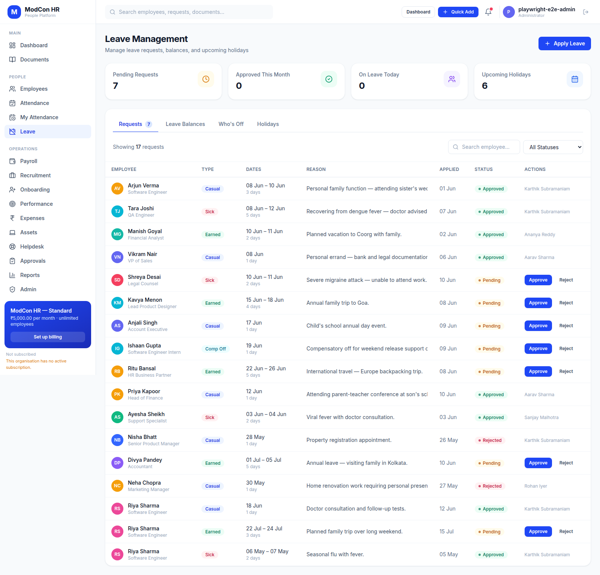
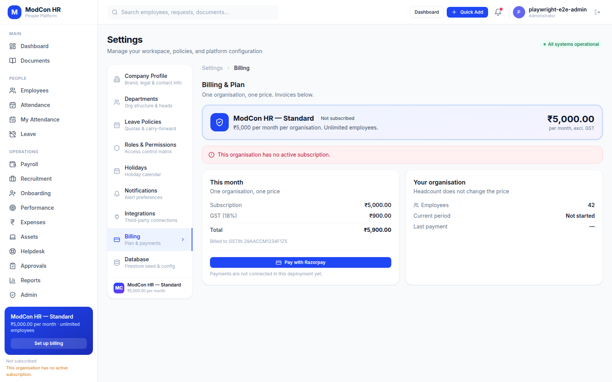

# ModCon HR

**A multi-tenant HR platform for Indian companies.** Hire-to-retire in one
application — people, attendance, leave, payroll, recruitment, performance — with
each customer's data isolated at the database, not just in the UI.

| | |
|---|---|
| **Live application** | **https://modcon-hr.web.app** |
| **Source** | **https://github.com/sumanthrb94-sudo/Modcon-HR** |
| Stack | React 18 · TypeScript (strict) · Vite · Tailwind · Firebase Auth + Firestore |
| Pricing model | ₹5,000 per organisation per month, flat — headcount does not change the bill |

---

## The application

Five screens from the running product, captured by
[`tests/e2e/portfolio.spec.ts`](tests/e2e/portfolio.spec.ts) against a live
build rather than mocked up.

### Dashboard
Headcount growth, attendance, diversity and the approval queue in one view.



### Employees
42 people across 10 departments, with filters, an org chart, and profiles that
carry the reporting line the rest of the product depends on.



### Attendance
The working week, check-in/out, late tracking and regularisation requests.



### Leave
Applications, approvals scoped to the approver's own reporting line, balances
computed from the organisation's leave policy.



### Billing
One organisation, one price. GST itemised, and the state of the subscription
taken from the server rather than assumed.



---

## What is actually interesting about it

Anyone can put an HR dashboard on a screen. Three things here took real work.

### 1. Multi-tenancy that holds at the database

Every document carries an `orgId`, and **every query filters on it** — not as an
optimisation but because Firestore evaluates a list against each document it
returns and fails the whole query if one belongs to another tenant. An
unfiltered read is denied, not merely wasteful.

The interesting failure mode is the asymmetry: security rules read a document
with no `orgId` as belonging to the legacy tenant, so old data stays *readable*
the moment org-scoped rules deploy — but equality filters match neither a
missing field nor a null one, so the same document is *invisible* to every
query. Permitted but unreachable. That gap is why the migration path is a
documented, dry-run-first backfill rather than a switch.

`docs/tenant-isolation-spec.md` sets out nine invariants, what a single Firebase
project can and cannot contain, and the conformance rules any new collection has
to meet.

### 2. Three test layers, because they answer different questions

| Layer | Assertions | Question it answers |
|---|---|---|
| **Security rules** (Firestore emulator) | **905** | Can one tenant reach another? |
| **Domain simulation** (Node, real modules) | **64** | Does a month of ordinary use work? |
| **End-to-end** (Playwright, live Firebase) | **93** | Does the product work in a browser? |

The middle layer is the one worth explaining. The rules suites all start from
fixtures written with security disabled — tenants that simply *exist*. That
answers "is the ruleset correct once two tenants are populated" and leaves
"**can a second organisation actually be onboarded**" untested. So
`tests/simulation/` provisions three organisations in order, issuing every write
through the rules as the principal who issues it in the app, and separately runs
a full month of leave for two ten-person companies — applications, approvals,
rejections, accruals, month-end balances.

It runs the application's real modules, bundled with esbuild, against an
in-memory `localStorage`. Nothing is reimplemented, so what it observes is what
the app does.

That layer found seven defects nothing else would have, including a manager
being notified about 7 leave requests and sent to a page listing 8 — with an
Approve button on the one outside their reporting line.

### 3. Billing that cannot be forged

The subscription record is the one thing a tenant must not control: it states
whether they have paid, and an organisation that could write it would write
`active`. So it lives in its own collection, readable by the organisation and
writable only by a platform admin or the Razorpay webhook running with admin
credentials. The client exports **no writer at all** — only a cache fed from the
snapshot listener.

33 rules assertions confirm that no role in the product — employee, manager, HR,
platform admin — can create, extend, activate, delete, or grant itself a free
plan.

Deliberately, **no rule anywhere consults a subscription.** Locking a company
out of its own employee records over a failed card is a commercial decision, not
a security one, and it would cost a document read on every single rule
evaluation. There is a seven-day grace period for the same reason.

---

## Engineering practices worth noting

- **Findings are pinned as tests, not prose.** Every defect the simulation found
  was first asserted *as it behaved*, then flipped to assert the fix — so a
  regression breaks a test rather than a document quietly going stale.
- **Fixes are shown to discriminate.** A security fix that cannot be
  demonstrated to fail without it has not been demonstrated at all. Reverting
  the cross-tenant read fix fails 26 of 525 onboarding assertions; the count is
  recorded.
- **Deploys are rehearsed.** `tests/rules/deploy-rehearsal.rules.test.mjs` runs
  the pending ruleset *and* the last-deployed one over a production-shaped
  fixture and measures the difference — so "who loses access if we ship this
  today" is an assertion rather than a hope.
- **Type checking is the CI gate.** `tsc -b` runs inside the build; the rules
  suite runs on every pull request.

---

## What is not built

Stated plainly, because a portfolio that only lists wins is not worth reading.

- **The payment server.** Razorpay's browser half cannot complete a payment
  alone, and the webhook signature is an HMAC over a secret a client bundle
  cannot hold. The client integration and the full server specification are
  written ([`docs/billing-razorpay.md`](docs/billing-razorpay.md)); the three
  endpoints are not deployed. The app says payments are not connected rather
  than offering a button that fails at the last step.
- **The employee directory is not yet server-authoritative.** It is a
  localStorage overlay, so a new organisation's roster is per-browser and the
  invite-to-employee link cannot resolve. This is the largest gap between "the
  demo works" and "a second customer can use it", and it is documented as such
  in [`docs/onboarding-readiness-report.md`](docs/onboarding-readiness-report.md).

---

## Running it

```bash
npm ci
npm run dev          # http://localhost:5173

npm run build        # tsc -b && vite build — the type-check gate
npm run test:rules   # 905 security-rules assertions (Firestore emulator, needs a JDK)
npm run test:sim     # 64 domain-simulation assertions (no network)
npm run test:e2e     # Playwright, against live Firebase
```

Deeper documentation lives in [`docs/`](docs/) — tenant isolation, the billing
model, the onboarding readiness report, and the leave simulation findings.
